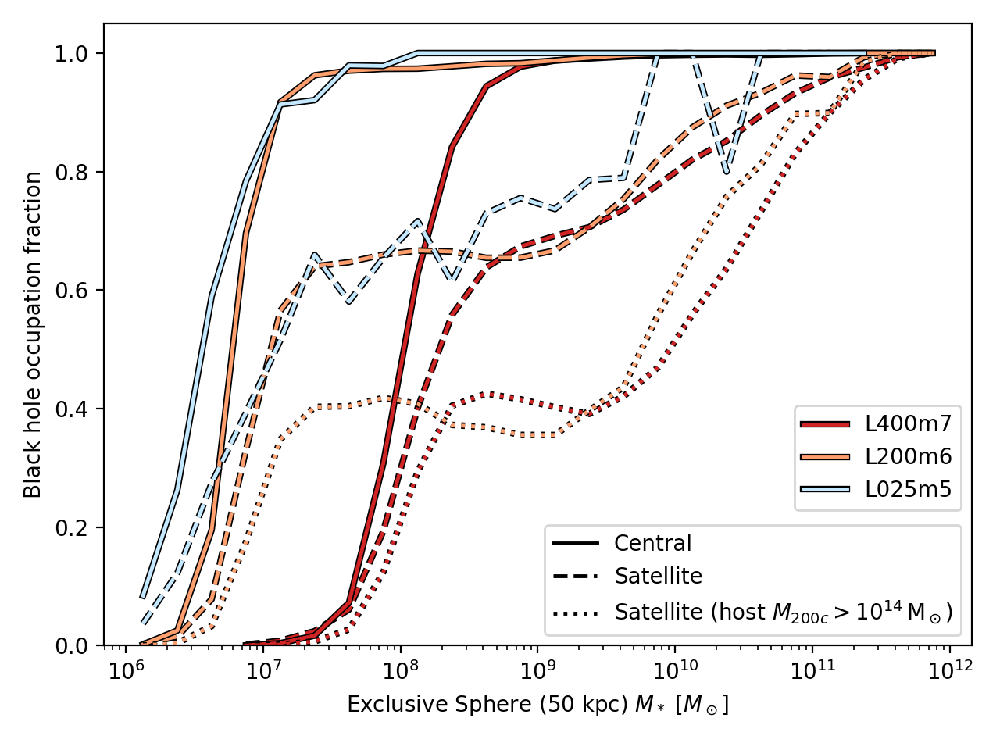

:orphan:

.. _extra_info_bh_occupation_fraction:

Black hole occupation fraction
==============================

Related to :ref:`issues_bh_satellites`.
The following plot shows the black hole occupation fraction
(the fraction of galaxies with at least 1 black hole) as a function of
stellar mass. Satellites in clusters are the most likely
to lose their black holes.

