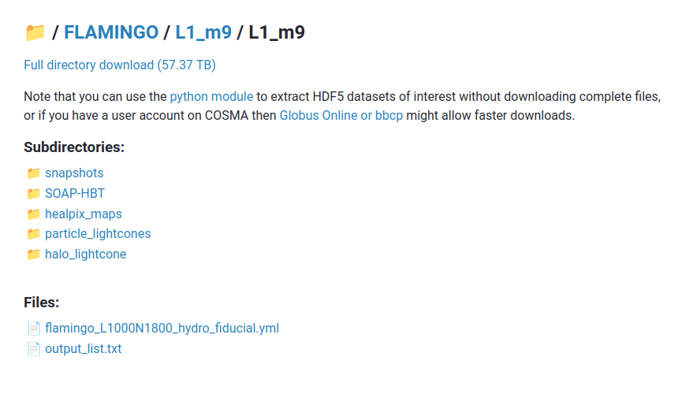
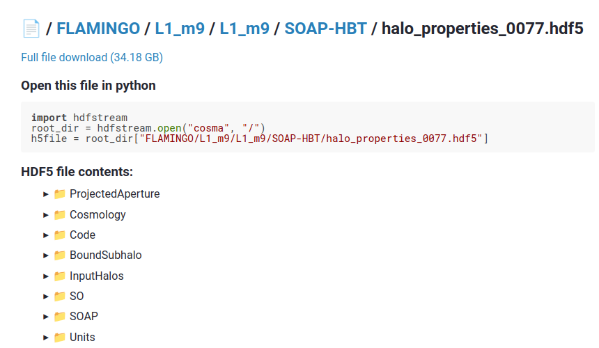

Browsing the available data
===========================

Directory listings
------------------

This web interface can be used to browse the available files. Use the
`FLAMINGO data </flamingo/viewer.html?path=/FLAMINGO>`__ link on the
left side of the page to view the FLAMINGO project root
directory. Each directory page contains links to any sub-directories
and files it contains.  You can navigate back to the parent directory
from a sub-directory by clicking on the parent directory name in the
path shown at the top of the page.

For example, `this page
</flamingo/viewer.html?path=FLAMINGO/L1_m9/L1_m9>`__ shows the
available data for the fiducial ``L1_m9`` hydro simulation.

Directory downloads
-------------------

Each directory listing page includes a "download options" drop down at
the top. This includes a link to to download the directory and its
contents as a tar file. It also shows how to download and unpack the
directory contents using the ``curl`` and ``tar`` command line
utilities.

.. warning:: These downloads can be extremely large! Smaller downloads
             can be found by navigating to subdirectories. The service
             does not attempt to limit download sizes because some
             users might have a lot of network bandwidth and disk
             space, but a warning is presented for large downloads.

Paths in the tar files are set such that when unpacked they reproduce the
directory structure shown in the web interface. This is to help prevent
confusion when several simulations contain files with the same name. If
several tar files are downloaded it is recommended to untar them all in the
same directory.

Example: downloading a full snapshot
^^^^^^^^^^^^^^^^^^^^^^^^^^^^^^^^^^^^

The :math:`z=0` snapshot for the ``L1_m10_DMO`` fiducial dark matter
only simulation is stored in this directory::

  FLAMINGO/L1_m10/L1_m10_DMO/snapshots/flamingo_0077

The download options section on the `directory listing page
</flamingo/viewer.html?path=FLAMINGO/L1_m10/L1_m10_DMO/snapshots/flamingo_0077>`__
shows that this directory can be downloaded and unpacked with the
following command::

  curl -L "https://dataweb.cosma.dur.ac.uk:8443/hdfstream/download/FLAMINGO/L1_m10/L1_m10_DMO/snapshots/flamingo_0077" | tar xvf -

Here, we use the ``curl`` command line utility to download the tar
file containing the snapshot directory and pipe the output directly
into the ``tar`` command for unpacking. This ensures that the files
are extracted from the tar archive without writing an intermediate
copy.

Full file downloads
-------------------

Clicking on a file on the directory listing page displays the contents
of the file and a link which can be used to download it.

The web interface can display the contents of HDF5 and text files. If
a file cannot be displayed, only a download link is provided.
