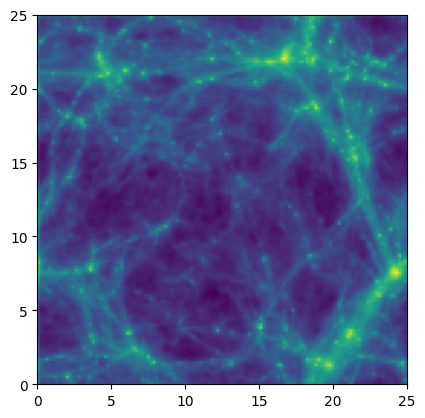

Reading snapshots with swiftsimio
=================================

The `swiftsimio <https://swiftsimio.readthedocs.io/en/latest/>`__
python module can be used to read snapshots. It can efficiently cut
out regions of interest from the snapshots and handles units and
cosmology metadata.

Installation
------------

The swiftsimio module can be installed as follows::

  pip install swiftsimio

Opening a snapshot
------------------

Each snapshot consists of a large number of data files and a single
:ref:`virtual snapshot file <virtual-snapshot>`. Swiftsimio
should be given the name of the virtual snapshot file, which
references the data in all of the other files. Here we open the
:math:`z=1` snapshot of the L025m7 simulation.

.. code-block:: python

   import swiftsimio as sw

   sim_dir = "/cosma8/data/dp004/colibre/Runs/"
   run = "L0025N0188/Thermal"
   snap_nr = 92 # z=1
   snapshot_filename = f"{sim_dir}/{base_dir}/SOAP-HBT/colibre_with_SOAP_membership_{snap_nr:04}.hdf5"

   snap = sw.load(snapshot_filename)

Snapshot metadata
-----------------

The ``snap`` object
returned by ``swiftsimio.load`` can be used to access simulation
metadata. The simulation box size is available as::

  snap.metadata.boxsize

If you need cosmology information, you can get an astropy `cosmology
object <https://docs.astropy.org/en/stable/cosmology/index.html>`__
with::

  cosmo = snap.metadata.cosmology

This allows accurate calculation of the age of the universe or the
comoving distance at a particular redshift in the COLIBRE cosmology,
for example. The numbers of particles of each type in the snapshot are
available as::

  snap.metadata.n_gas
  snap.metadata.n_dark_matter
  snap.metadata.n_stars
  snap.metadata.n_black_holes
  snap.metadata.n_neutrinos

The expansion factor and redshift of the snapshot are also available::

  snap.metadata.a
  snap.metadata.z

To see what particle types exist in this snapshot::

  >>> print(snap)
  SWIFT dataset at /cosma8/data/dp004/colibre/Runs/L0025N0188/Thermal/SOAP-HBT/colibre_with_SOAP_membership_0092.hdf5. 
  Available groups: gas, dark_matter, stars, black_holes

And to see the particle properties available for one particle type::

  >>> print(snap.dark_matter)
  SWIFT dataset at /cosma8/data/dp004/colibre/Runs/L0025N0188/Thermal/SOAP-HBT/colibre_with_SOAP_membership_0092.hdf5. 
  Available fields: coordinates, fofgroup_ids, group_nr_bound, halo_catalogue_index, masses, particle_ids, potentials, rank_bound, specific_potential_energies, velocities

See the `swiftsimio documentation
<https://swiftsimio.readthedocs.io/en/latest/loading_data/index.html#using-metadata>`__
on snapshot metadata for more information.

Reading particle data
---------------------

Particle properties, such as position, mass or velocity, are only read in
or when you try to access them. You can see what properties are 
available by using tab completion. To read the coordinates of
all star particles in the simulation::

  star_pos = snap.stars.coordinates

The result is a `cosmo_array
<https://swiftsimio.readthedocs.io/en/latest/cosmo_array/index.html>`__,
which is is a numpy array with unit and cosmology information
attached. Units are handled using the `unyt
<https://unyt.readthedocs.io/en/stable/>`__ module. In this example,
the cosmo array records that the particle positions are in comoving
Mpc::

   >>>  print(star_pos)
   [[6.72585729e-01 2.76213729e-01 3.18276073e+00]
    [7.80392729e-01 6.61870729e-01 3.59051173e+00]
    [2.21917288e-02 1.27776973e+00 3.66487173e+00]
    ...
    [2.34653514e+01 2.40933144e+01 2.49001234e+01]
    [2.34675064e+01 2.40928574e+01 2.48974284e+01]
    [2.40909894e+01 2.49992534e+01 2.48510784e+01]] Mpc (Comoving)

Arrays can easily be converted to different units, and between comoving
and physical. **You should should always specify the units you want**::

   >>> print(star_pos.to_physical().to('kpc'))
   [[3.36292864e+02 1.38106864e+02 1.59138036e+03]
    [3.90196364e+02 3.30935364e+02 1.79525586e+03]
    [1.10958644e+01 6.38884864e+02 1.83243586e+03]
    ...
    [1.17326757e+04 1.20466572e+04 1.24500617e+04]
    [1.17337532e+04 1.20464287e+04 1.24487142e+04]
    [1.20454947e+04 1.24996267e+04 1.24255392e+04]] kpc (Physical)

The property descriptions can also be access from the ``cosmo_array``::

   >> print(data.stars.masses.name)
   Masses of the particles at the current point in time (i.e. after stellar losses)

Masking
-------

The particles in Swift snapshots are ordered in a way that allows us
to read regions from a snapshot without reading the entire file. Given
a range of coordinates in x, y, and z, swiftsimio can compute which
parts of the file to read or download to find the corresponding
particles. This is referred to as `spatial masking
<https://swiftsimio.readthedocs.io/en/latest/masking/>`__, and can
significantly reduce the time spent loading data.

.. code-block:: python

   # Create a mask object
   mask = sw.mask(snapshot_filename)
   boxsize = mask.metadata.boxsize

   # Specify the region of the box we want to load (this requires units)
   load_region = [[0.1 * b, 0.3 * b] for b in boxsize]

   # Constrain the region to read
   mask.constrain_spatial(load_region)

   # Open the snapshot using the mask
   snap = sw.load(snapshot_filename, mask=mask)

   # Read the coordinates of gas particles in the region
   gas_pos = snap.gas.coordinates

Visualisation
-------------

Sometimes being able to visualise regions of the simulation can help provide insights into the data you are working with. `Swiftsimio supports multiple options for this <https://swiftsimio.readthedocs.io/en/latest/visualisation/index.html>`__. Here we give the example of projecting the gas density.

.. code-block:: python

   snap = sw.load(snapshot_filename)
   boxsize = snap.metadata.boxsize[0].to('Mpc').value
   extent = [0, boxsize, 0, boxsize]

   mass_map = sw.visualisation.projection.project_gas(
       snap,
       resolution=128,
       project="masses",
       parallel=True,
       periodic=True,
   )

   mass_map = mass_map.to('Msun/kpc**2').value

   plt.imshow(LogNorm()(mass_map), cmap="viridis", extent=extent)

