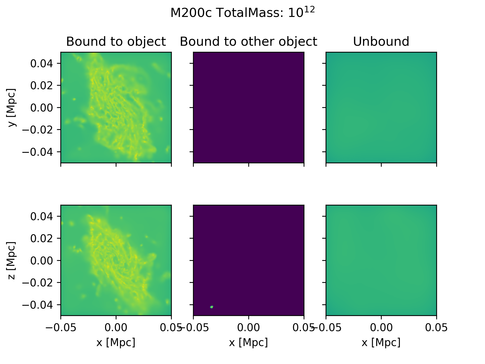
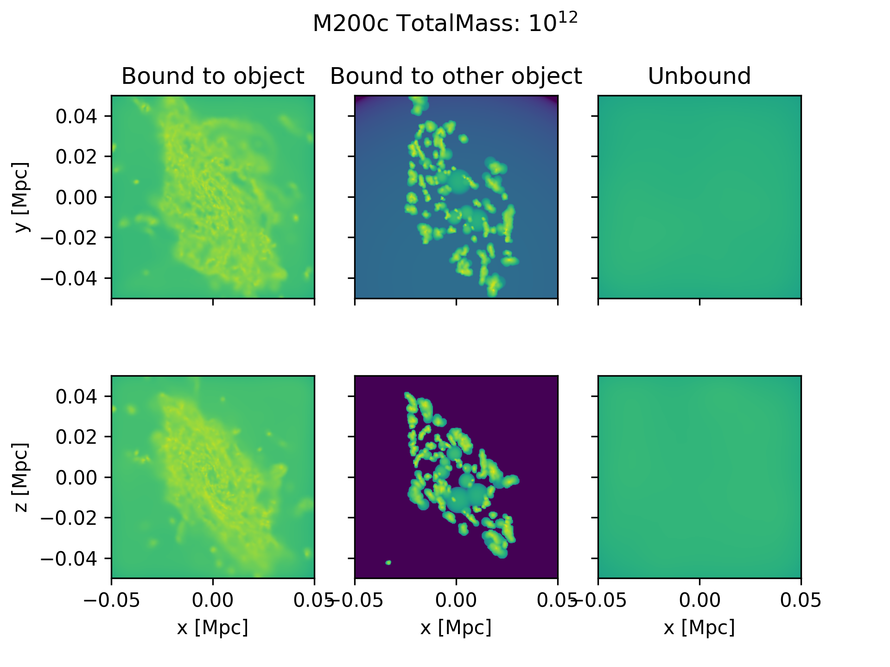
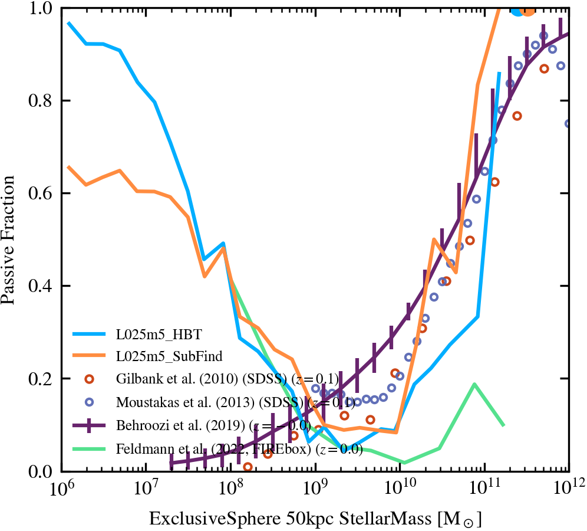
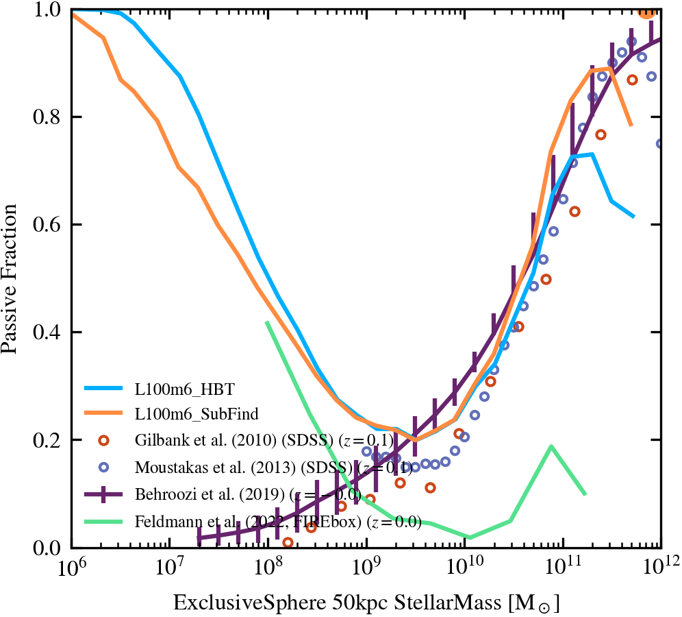
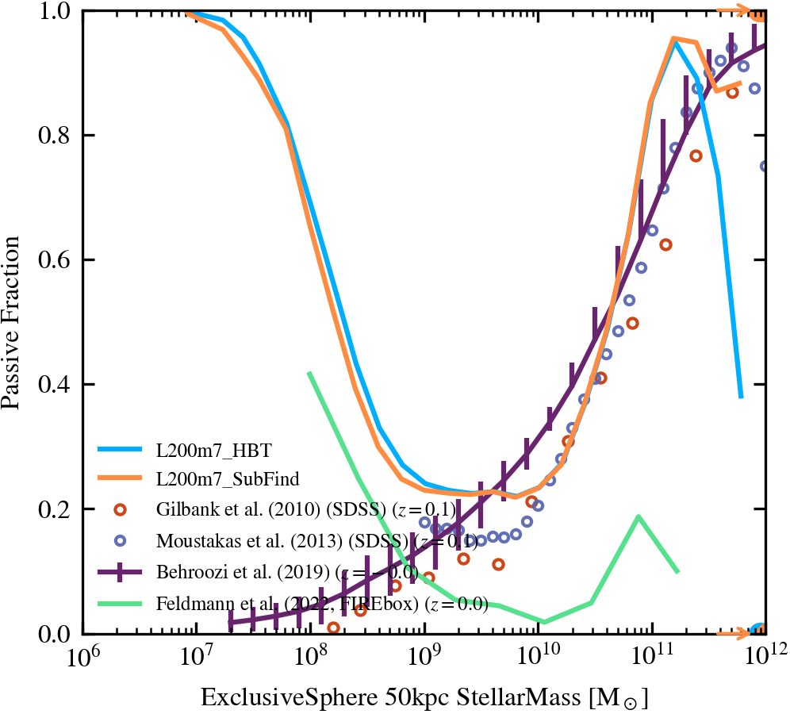

:orphan:

.. _subfind_vs_hbt:

Subfind vs HBT-HERONS
=====================

Pipeline plots comparing HBT and Subfind for three resolutions are available at

- https://home.strw.leidenuniv.nl/~mcgibbon/COLIBRE/pipeline/comparison/L025m5_subfind/
- https://home.strw.leidenuniv.nl/~mcgibbon/COLIBRE/pipeline/comparison/L100m6_subfind/
- https://home.strw.leidenuniv.nl/~mcgibbon/COLIBRE/pipeline/comparison/L200m7_subfind/

Most properties agree well, with the exception being properties related to cold gas. This is because Subfind often identifies dense gas clumps within the ISM as individual subhalos. Below are two images of the same object to demonstrate this, both showing projections of the gas particles based on the subhalo they are bound to. The first plot uses the HBT memberships, and the second uses the Subfind memberships. You can see how Subfind identifies a large number of gas clumps as separate objects. Note that because of this fundamental difference in how each subhalo finder works, the difference between the HBT and Subfind catalogues should not be used as an indication of the error due to the halo finding.

Below are three plots of quenched fractions from the pipeline, one for each resolution. At the low mass end Subfind has a lower quenched fraction. This is because the Subfind catalogue contains many individual clumps, nearly all of which will be star forming. At the high mass end Subfind has a higher quenched fraction. This is because many star forming clumps are removed from massive star forming galaxies, reducing their SFR, and making them more likely to be classified as quenched. The difference increases with resolution, and is probably worse for COLIBRE than for previous simulations without a multiphase ISM

