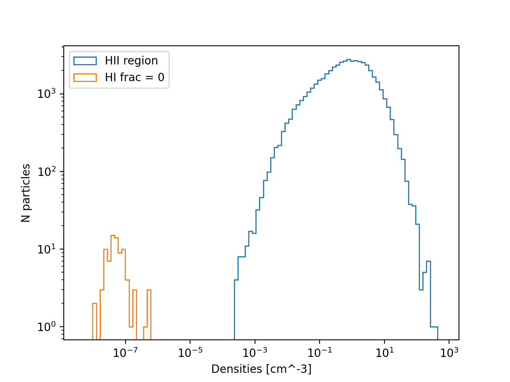

:orphan:

.. _extra_info_hii_regions:

Identifying HII regions
=======================

Related to :ref:`issues_hii_regions`.

The plot below shows all particles from z=0.3 of the L400m7 with ``HI/H == 0``.
Those with ``PartType0/HIIregionsEndTime != -1`` (which are currently in an HII region)
are plotted in blue. Those which are not currently in an HII region are plotted
in orange. It can be seen that a cut on density will pick out those particles
which are currently in an HII region.

