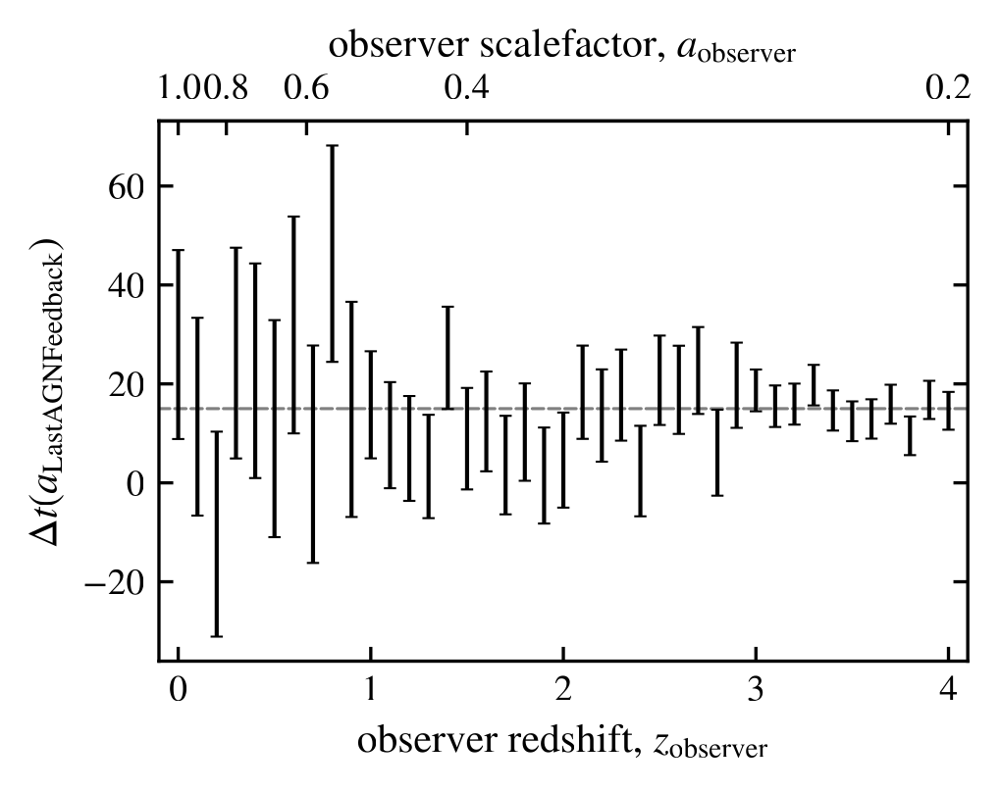

:orphan:

Compression of scale factors
============================

.. _issues_compression_images:

Figure related to :ref:`issues_compression`.

For a given observer, at a set redshift, we compute the exact scalefactor the corresponds to 15Myr ago, which is the correct minimum value for ``LastAGNFeedbackScaleFactors``. We then compress this correct ``LastAGNFeedbackScaleFactors`` as given by the ``BFloat16`` filter that was applied to the lightcone values, and then reading it back in as if it was not compressed. We mimic the compression effects by simply converting the float to a bit value, removing the bits that are not stored due to the ``BFloat16`` and then replacing them by randomly sampling those removed bits.

For each correct scalefactor we sample :math:`10^{5}` compressed scalefactors, for each we then compute the time between the observer and that indicated by the compressed ``LastAGNFeedbackScaleFactors``.
The observer redshifts and scale factors are given on the x-axes, the y-axes shows the time between the observer and :math:`\pm 1` standard deviation of the sampled compressed ``LastAGNFeedbackScaleFactors`` for the given observer.

