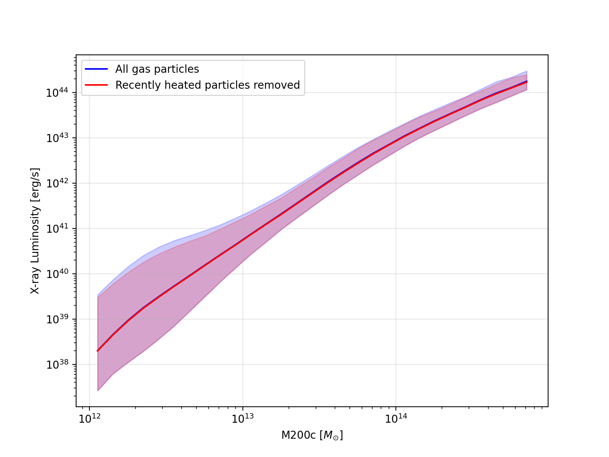
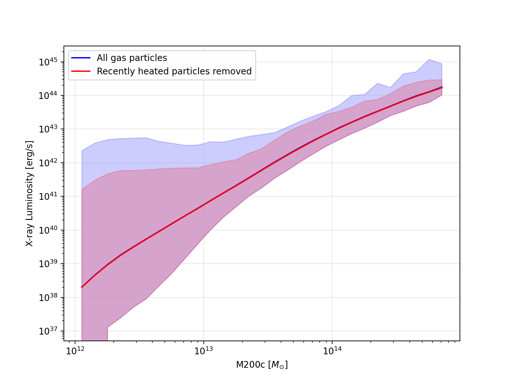

:orphan:

Compression of scale factors
============================

.. _issues_incorrect_dT_images:

Figure related to :ref:`issues_incorrect_dT`.

The number of particles that will  be incorrectly filtered depends on the difference between the :math:`\Delta T_\text{AGN}` value for that run and :math:`\Delta T_\text{AGN}=10^{7.95}\mathrm{K}` from the ``L1_m9`` (see Table 1 of `Schaye et al. (2023)
<https://ui.adsabs.harvard.edu/abs/2023MNRAS.tmp.2384S>`__ for a list of values).

Plot from :math:`z=0` of the ``L1_m9`` showing the Xray luminosity-mass relation where the shaded region indicates a scatter of 2 sigma.

Plot from :math:`z=0` of the ``L1_m9`` showing the Xray luminosity-mass relation where the shaded region indicates a scatter of 3 sigma.

