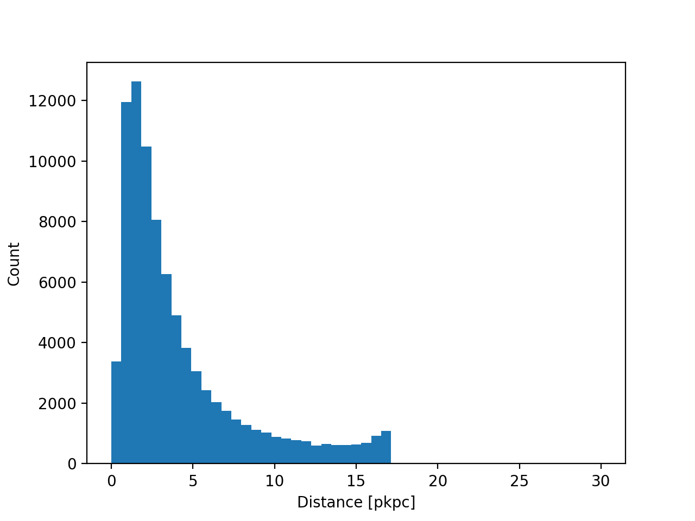

:orphan:

Replication of black holes
==========================

.. _issues_reposition_bh_images:

Figures related to :ref:`issues_reposition_bh`.

This figure was generated by looping through the first L1m9 particle lightcone, and identifying any pairs of black holes particles with the same ID which are less than 0.1 comoving Mpc apart. The plot below shows the distribution of the physical distance between the pairs identified.

