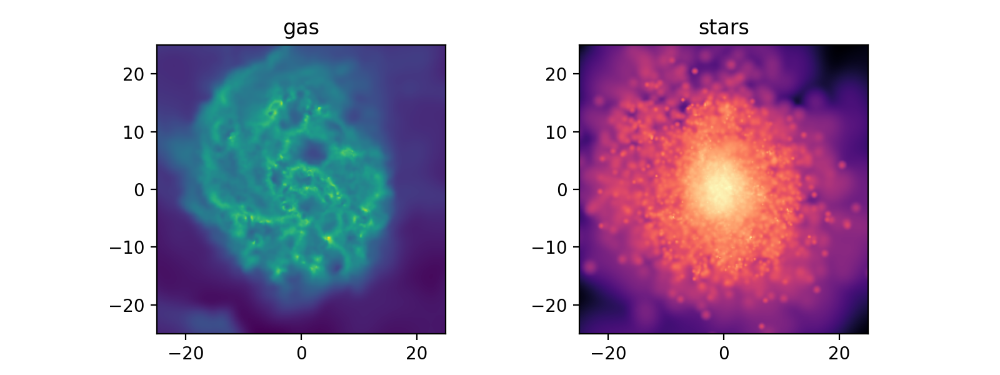

SWIFTGalaxy
===========

The `swiftgalaxy <https://swiftgalaxy.readthedocs.io/en/stable/index.html>`__
python module can be used to analyse particles belonging to individual galaxies.
It is build on top of :doc:`swiftsimio <swiftsimio>` and inherits all of its features,
while adding features designed for working with individual galaxies.

Installation
------------

The swiftgalaxy module can be installed as follows::

  pip install swiftgalaxy

Creating a SWIFTGalaxy
----------------------

A ``SWIFTGalaxy`` needs two things: the path to the virtual snapshot
file (the same file used with swiftsimio, which must contain the HBT-Herons
membership information) and an initialised halo finder object. For
COLIBRE outputs we use the ``SOAP`` halo catalogue class. The
``soap_index`` identifies the row in the SOAP catalogue corresponding
to the galaxy of interest.

.. code-block:: python

   from swiftgalaxy import SWIFTGalaxy, SOAP

   sim_dir = "/cosma8/data/dp004/colibre/Runs/"
   run = "L0025N0752/THERMAL_AGN_m5"
   snap_nr = 127

   virtual_snapshot_file = f"{sim_dir}/{run}/SOAP-HBT/colibre_with_SOAP_membership_{snap_nr:04}.hdf5"
   soap_catalogue_file   = f"{sim_dir}/{run}/SOAP-HBT/halo_properties_{snap_nr:04}.hdf5"

   sg = SWIFTGalaxy(
       virtual_snapshot_file,
       SOAP(
           soap_catalogue_file,
           soap_index=42,
       ),
   )

We can load a SOAP catalogue with swiftsimio to pick a target. Here for example a
galaxy with :math:`M_{200c} \approx 10^{11}\,\mathrm{M}_\odot`

.. code-block:: python

    import numpy as np
    import unyt as u
    from swiftsimio import load, cosmo_quantity

    soap = load(soap_catalogue_file)
    m200c = soap.spherical_overdensity_200_crit.total_mass
    candidates = np.argwhere(
        np.logical_and(
            m200c > cosmo_quantity(
                1e11,
                u.solMass,
                comoving=True,
                scale_factor=soap.metadata.scale_factor,
                scale_exponent=0,
            ),
            m200c < cosmo_quantity(
                2e11,
                u.solMass,
                comoving=True,
                scale_factor=soap.metadata.scale_factor,
                scale_exponent=0,
            ),
        )
    ).squeeze()

    sg = SWIFTGalaxy(
        virtual_snapshot_file,
        SOAP(soap_catalogue_file, soap_index=candidates[0]),
    )

Accessing particle data
-----------------------

Because ``SWIFTGalaxy`` inherits from ``SWIFTDataset``, particle data
are accessed in exactly the same way as in swiftsimio, with lazy
loading and unit-aware ``cosmo_array`` results. See
:doc:`swiftsimio <swiftsimio>` for a full description of how to work
with these arrays. The key difference is that the coordinates are
automatically recentred on the galaxy of interest at construction
time, so all coordinates are in the galaxy's rest frame. If we print
the median we can see the value is close to zero as expected::

  >>> print(np.median(sg.stars.coordinates, axis=0)
  [-0.00043459 -0.00018946  0.00061128] Mpc (Comoving)

SOAP integrated properties are also available through the
``halo_catalogue`` attribute. Only the properties of the selected
galaxy are loaded::

  m200c = sg.halo_catalogue.spherical_overdensity_200_crit.total_mass.to(u.solMass)

``SWIFTGalaxy`` also provides spherical and cylindrical coordinates and 
velocities as a convenience (they are lazily calculated/re-calculated as needed),
for example the :math:`z`-component of the gas specific angular momentum becomes very
easy to calculate::

  jz_gas = np.sum(sg.gas.spherical_coordinates.r * sg.gas.spherical_velocities.phi)

Visualisation
-------------

Because ``SWIFTGalaxy`` is a ``SWIFTDataset``, the swiftsimio
visualisation tools work directly on it. The galaxy coordinates are
already centred at the origin, so passing a ``region`` argument lets
you zoom into the disc or halo straightforwardly. Always set
``periodic=False`` when visualising a ``SWIFTGalaxy``.

.. code-block:: python

    from swiftsimio import cosmo_array
    from swiftsimio.visualisation.projection import project_gas, project_pixel_grid
    import matplotlib.pyplot as plt
    from matplotlib.colors import LogNorm
    import unyt as u

    disc_radius = 25.0 * u.kpc
    disc_region = cosmo_array(
        [-disc_radius, disc_radius, -disc_radius, disc_radius],
        comoving=False,
        scale_factor=sg.metadata.scale_factor,
        scale_exponent=1,
    )

    gas_map = project_gas(
        sg,
        resolution=256,
        project="masses",
        parallel=True,
        periodic=False,
        region=disc_region,
    )
    # Using the stellar smoothing lengths from the snapshots (computed using the gas)
    star_map = project_pixel_grid(
        data=sg.stars,
        resolution=256,
        project="masses",
        parallel=True,
        periodic=False,
        region=disc_region,
    )

    fig, (ax1, ax2) = plt.subplots(1, 2, figsize=(8, 3))
    ax1.imshow(
        LogNorm()(gas_map.to_value(u.solMass / u.kpc**2).T),
        cmap="viridis",
        extent=disc_region,
        origin="lower",
    )
    ax1.set_title("gas")
    ax2.imshow(
        LogNorm()(star_map.to_value(u.solMass / u.kpc**2).T),
        cmap="magma",
        extent=disc_region,
        origin="lower",
    )
    ax2.set_title("stars")

Coordinate transformations
--------------------------
 
All particle types in a ``SWIFTGalaxy`` share a common coordinate
frame and always transform together. Rotations, translations and
velocity boosts are all supported. Rotations are specified using the
`scipy Rotation class
<https://docs.scipy.org/doc/scipy/reference/generated/scipy.spatial.transform.Rotation.html>`__,
which accepts rotation matrices, Euler angles, and more.
 
A common use case is to align the galaxy face-on using the angular
momentum vector pre-computed by SOAP:
 
.. code-block:: python
 
   import numpy as np
   from scipy.spatial.transform import Rotation
 
   Lstars = sg.halo_catalogue.exclusive_sphere_10kpc.angular_momentum_stars.squeeze()
   rot, _ = Rotation.align_vectors([0, 0, 1], Lstars / np.linalg.norm(Lstars))
   sg.rotate(rot)
 
After the rotation every particle type is automatically in the new
frame, and subsequently loaded properties will also be in that frame.

Further reading
---------------

``SWIFTGalaxy`` is `fully documented <https://swiftgalaxy.readthedocs.io/en/stable/index.html>`__
and there is also a COLIBRE `quick-start guide notebook <https://github.com/SWIFTSIM/swiftgalaxy/blob/main/examples/SWIFTGalaxy_Colibre_QuickStart.ipynb>`__ 
with additional examples.

