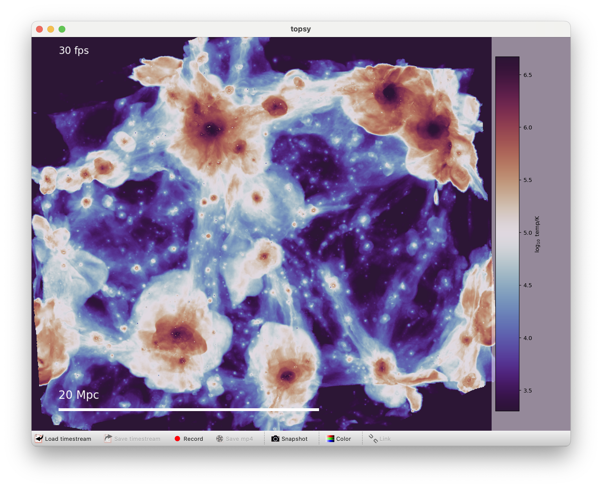

Topsy
=====

`Topsy <https://github.com/pynbody/topsy/>`__ is a tool
created by Andrew Pontzen
that uses GPUs to perform
visualisation of simulations.

You can run topsy on your own machine if it uses Linux or MacOS and
has a reasonable GPU (it has been developed mainly on Apple’s M1
processor, for example, which has a good integrated GPU). On my
machine with 32GB RAM I am able to visualise up to 752^3 runs at fast
frame rates and the quality remains quite high.

You can also run topsy remotely on cosma’s GPU nodes, although it
involves a bit of hassle with the forwarding, and the performance is
not brilliant. But in my tests I have been able to scale up to 1504^3
sims on cosma; it works, but the quality isn’t great. 

**1) Running locally – the best solution if you can**

1.  Ensure you have python 3.11 or preferably later installed
2.  Install topsy into a self-contained environment by typing (here
    using python 3.12)::

      python3.12 -m venv topsy_venv
      source topsy_venv/bin/activate
      pip install topsy

3.  Type ``topsy test://`` to check it’s working. You should get a python
    window showing a simple test particle distribution. You can drag to
    spin it round and check it’s OK.

4.  Copy a COLIBRE snapshot onto your local machine, e.g.::

      scp -r login8.cosma.dur.ac.uk:/cosma8/data/dp004/colibre/Runs/L0025N0376/Thermal/snapshots/colibre_0123 ./

5.  Run topsy on the resulting snapshot, selecting gas particles for example::

      topsy colibre_0123/colibre_0123.hdf5 -p gas

**2) Installing on cosma**

To run on cosma you need to tunnel either a jupyter session or an X
session through to your local machine.

First, we need to make a good environment in which to run topsy.
Connect to a login node then type::

  module purge
  module load intel_comp compiler-rt tbb compiler mpi python/3.12.4
  python3.12 -m venv topsy_venv
  source topsy_venv/bin/activate
  pip install topsy jupyterlab

**2.1 Forwarding an X11 window**

To use topsy on cosma, you might want to use X11 forwarding. (For
reasons unknown, it doesn’t seem to work over X2go). You need to
forward both the login connection and the onward connection to a gpu
node, e.g.::

  ssh -Y login8.cosma.dur.ac.uk
  ssh -Y gn001
  module load intel_comp compiler-rt tbb compiler mpi python/3.12.4
  source topsy_venv/bin/activate
  topsy -p gas /cosma8/data/dp004/colibre/Runs/L0025N0376/Thermal/snapshots/colibre_0123/colibre_0123.hdf5

And now you should be able to see the gas; jump to general
instructions below.

**2.2 Alternative: use jupyter**

Now we’ll cover using jupyter. General information about tunnelling
jupyter can be found here: https://cosma.readthedocs.io/en/latest/jupyter.html
Here we are running our own jupyter lab instance instead of cosma's jupyterhub.

Let’s use a port 8123 for this example (if someone else is using it,
you might have to use a different one). Starting on my own machine, I
type::

  ssh -L8123:localhost:8123 login8.cosma.dur.ac.uk

Then at the cosma prompt I do the hop to an open GPU node (https://cosma.readthedocs.io/en/latest/gpu.html)::

  ssh -L8123:localhost:8123 gn001

On the GPU node, I get back to my environment and launch jupyter::

  module load intel_comp compiler-rt tbb compiler mpi python/3.12.4
  source topsy_venv/bin/activate
  jupyter lab --port=8123 --no-browser

Once started jupyter shows me the URL to go in a browser (of the form of https://localhost:8123/lab?token=xxxxxxx). 
Open that up, and create a jupyter notebook. Inside a jupyter cell execute::

  import topsy

  topsy.load("/cosma8/data/dp004/colibre/Runs/L0025N0376/Thermal/snapshots/colibre_0123/colibre_0123.hdf5", particle='gas')

Now you should have an interactive view of the gas.

Note that since you’re loading the particles from a read-only
location, topsy has to create smoothing data each time which takes a
while. If you want to visualise the same simulation many times, you
might like to symlink the hdf5 files into your own folder, where
topsy is free to create cache files.

**3) General instructions**

Once topsy is working, there are a range of simple controls:

* **Drag** to rotate
* **Shift-drag** to move
* **Double click** to centre on a feature of interest
* **Scroll up/down** to zoom in/out. (If in jupyter you may first need to click, to
  prevent the browser view from actually scrolling)
* Open colour controls by clicking “color” at the bottom if running
  in windowed mode, or just look below the view if running within
  jupyter.

  * Here you can choose available colourmaps / quantities from
    respective dropdowns.
  * You can also change the scaling using the sliders

* If you want a three-colour view of the stars, try e.g. ``topsy colibre_0123/colibre_0123.hdf5 -p star --rgb``;
  or from a jupyter cell, ``topsy.load("/path/to/file", particle='star', rgb=True)``
* If you are loading a file that doesn’t comfortably fit in RAM, you
  can use swift’s native spatial information to load a subregion - try typing ``topsy --help`` and look at
  the load-sphere option.

